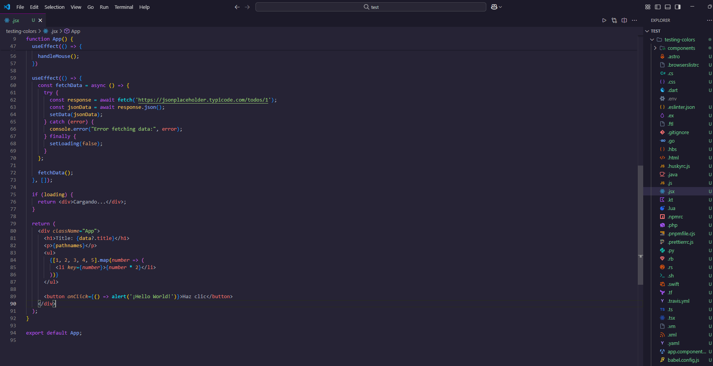

# New Wave Theme

Dark and modern theme inspired by retro futuristic style.

## Screenshots

## Why?

This theme, with a retrofuturistic inspiration, aims to maintain the retro essence of other community designs through a warmer color palette.

## License

This project is licensed under the MIT License - see the [LICENSE](./LICENSE.md) file for details.

## Contributions

Contributions are welcome! If you have suggestions for improvements:

1. Fork the repository
2. Create a feature branch (`git checkout -b feature/improvement`)
3. Commit your changes (`git commit -m 'Add improvement'`)
4. Push to the branch (`git push origin feature/improvement`)
5. Open a Pull Request

---

# New Wave Theme (Español)

Tema oscuro y moderno inspirado en un estilo retro-futurista.

## ¿Por qué?

Este tema, con inspiración retrofuturista, busca mantener la esencia retro de otros diseños de la comunidad a través de una paleta de colores más cálida.

## Licencia

Este proyecto está licenciado bajo la Licencia MIT - consulta el archivo [LICENSE](./LICENSE.md) para más detalles.

## Contribuciones

¡Las contribuciones son bienvenidas! Si tienes sugerencias para mejoras:

1. Haz fork del repositorio
2. Crea una rama de característica (`git checkout -b feature/mejora`)
3. Haz commit de tus cambios (`git commit -m 'Añadir mejora'`)
4. Haz push a la rama (`git push origin feature/mejora`)
5. Abre un Pull Request

---

Made with ❤️ for the developer community.  
Hecho con ❤️ para la comunidad de desarrolladores.

**Enjoy!**